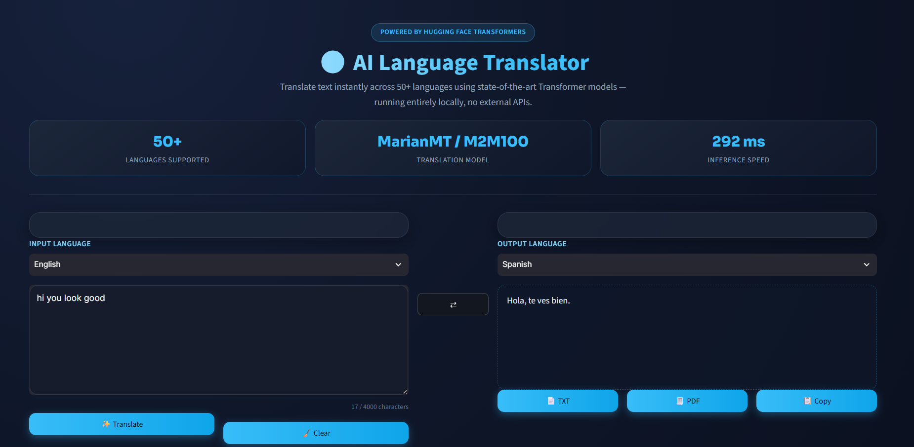

# 🌍 AI Language Translator

A premium, SaaS-styled AI translation web app built with **Streamlit**,
**Hugging Face Transformers**, and **PyTorch** — running **100% local
inference** (no Google Translate API, no external translation service).

---

## 📖 Project Overview

AI Language Translator lets you translate text between 50+ languages
instantly, using pretrained Transformer models downloaded from the
Hugging Face Hub and run locally on your machine (CPU or GPU).

The interface is designed to feel like a modern SaaS product (in the
spirit of DeepL / Grammarly / Notion AI) rather than a default
Streamlit app — dark theme, glassmorphism cards, gradient buttons,
smooth animations, and a responsive multi-column layout.

---

## ✨ Features

- 🔤 **50+ supported languages**
- 🧠 **Auto Language Detection** (via `langdetect`)
- ⇄ **One-click language swap**
- ⚡ **Instant local translation** (no API keys, no internet-dependent
  translation service — only the one-time model download needs internet)
- 📋 **Copy translation**
- 📄 **Download as TXT**
- 🧾 **Download as PDF**
- 🕘 **Translation history** (persisted to a local JSON file)
- ⭐ **Favorite translations**
- 🔍 **Search translation history**
- 🗑️ **Clear history**
- 🎨 **Dark, glassmorphism SaaS theme**
- 📱 **Responsive layout**
- 🌀 **Loading spinners, skeletons, hover & fade animations**
- 🛡️ **Graceful error handling** (model download issues, empty input, etc.)

---

## 📸 Screenshot




---


## 🧠 How It Works

1. You select a **source language** (or "Auto Detect") and a **target
   language**, and type or paste text into the input box.
2. When you click **Translate**, the app:
   - Detects the source language automatically if "Auto Detect" is
     selected, using `langdetect`.
   - Checks whether a dedicated **MarianMT** model exists for that
     specific language pair (e.g. `en → es`).
   - If yes, it loads (and caches) that MarianMT model and tokenizer
     and runs local inference.
   - If no dedicated MarianMT pair exists, it automatically falls back
     to **Facebook's M2M100** multilingual model, which supports
     translation across 100 languages in any direction.
3. The translated text, model used, and timing are displayed, and the
   translation is saved to your local history.

All models are cached with `st.cache_resource` so each model is only
downloaded and loaded into memory **once per session** — subsequent
translations with the same language pair are fast.

### Transformer Architecture

Both MarianMT and M2M100 are **encoder–decoder Transformer** models:

- The **encoder** reads the source sentence and builds contextual
  representations of each token using self-attention.
- The **decoder** generates the translated sentence token-by-token,
  attending to both the encoder's output and its own previously
  generated tokens (cross-attention + self-attention).
- Beam search / greedy decoding (via `model.generate()`) is used to
  produce the final translated text.

### Hugging Face Models Used

| Model | Use case | Library |
|---|---|---|
| `Helsinki-NLP/opus-mt-{src}-{tgt}` | Fast, specialized bilingual translation | `MarianMTModel` + `MarianTokenizer` |
| `facebook/m2m100_418M` | Universal fallback for any of 100 languages | `M2M100ForConditionalGeneration` + `M2M100Tokenizer` |

### PyTorch

Both model families are loaded as PyTorch `nn.Module` instances. The
app automatically detects and uses a CUDA GPU if available
(`torch.cuda.is_available()`), otherwise it runs on CPU.

---

## 🗂️ Project Structure

```
translator-app/
│
├── app.py                     # Main Streamlit app (UI + orchestration)
├── translator.py               # Model loading + translation engine
├── styles.py                   # Custom CSS (premium SaaS theme)
├── utils.py                    # Stats, history, export helpers
├── requirements.txt
├── README.md
│
├── assets/                     # Optional logo/banner images
├── models/                     # (Reserved for any locally cached model artifacts)
└── history/
    └── translation_history.json   # Local translation history (auto-created)
```

---

## 🛠️ Tech Stack

- **Frontend:** Streamlit, custom CSS, Google Fonts, glassmorphism, animations
- **Backend:** Python 3.12
- **AI / NLP:** Hugging Face Transformers (MarianMT, M2M100)
- **Framework:** PyTorch
- **Extras:** SentencePiece, Tokenizers, langdetect, fpdf2

---

# 🖥️ Installation & Setup Guide (Visual Studio Code on Windows)

This is a complete, beginner-friendly walkthrough for getting the app
running on **Windows** using **Visual Studio Code**.

## 1. Install Python 3.12.x

1. Go to https://www.python.org/downloads/ and download **Python
   3.12.x** for Windows.
2. Run the installer. ✅ **Check "Add python.exe to PATH"** before
   clicking Install.
3. Verify the install by opening **Command Prompt** and running:
   ```
   python --version
   ```
   It should print something like `Python 3.12.x`.

## 2. Open the Project Folder in VS Code

1. Open **Visual Studio Code**.
2. Go to **File → Open Folder…** and select the `translator-app`
   folder.

## 3. Open the Integrated Terminal

- Use the menu: **Terminal → New Terminal**, or press `` Ctrl + ` ``.

## 4. Create a Virtual Environment

In the VS Code terminal, run:

```
python -m venv .venv
```

This creates an isolated Python environment inside a `.venv` folder.

## 5. Activate the Virtual Environment

**PowerShell** (VS Code's default terminal on Windows):
```
.venv\Scripts\Activate.ps1
```

If PowerShell blocks the script with an execution policy error, run
this once (in an elevated PowerShell) and try activating again:
```
Set-ExecutionPolicy -Scope CurrentUser -ExecutionPolicy RemoteSigned
```

**Command Prompt** (if you're using `cmd.exe` instead):
```
.venv\Scripts\activate
```

You'll know it worked when you see `(.venv)` at the start of your
terminal prompt.

## 6. Upgrade pip

```
python -m pip install --upgrade pip
```

## 7. Install Dependencies

```
pip install -r requirements.txt
```

## 8. PyTorch: CPU vs. GPU (NVIDIA CUDA)

The `requirements.txt` file installs the **default CPU build** of
PyTorch, which works on every machine. If you have an **NVIDIA GPU**
and want faster inference, install the CUDA build instead.

**Option A — CPU only (works everywhere, simplest):**
```
pip install torch==2.4.1
```
(this is already handled by `requirements.txt`, no extra step needed)

**Option B — NVIDIA GPU with CUDA 12.1:**
```
pip install torch==2.4.1 --index-url https://download.pytorch.org/whl/cu121
```

**Option C — NVIDIA GPU with CUDA 11.8:**
```
pip install torch==2.4.1 --index-url https://download.pytorch.org/whl/cu118
```

> 💡 Not sure which CUDA version you have? Run `nvidia-smi` in a
> terminal — it shows the maximum supported CUDA version in the top
> right of the output. Pick the closest matching option above.

After installing the GPU build, verify it's detected:
```
python -c "import torch; print(torch.cuda.is_available())"
```
This should print `True` if your GPU is correctly configured.

## 9. Verifying the Hugging Face Model Downloads Successfully

The **first time** you translate a given language pair, the app will
download the corresponding model from the Hugging Face Hub (a
one-time download, typically 300 MB–1.2 GB depending on the model).

- You'll see a **"Running Transformer inference..."** spinner in the
  app while this happens — it may take 30 seconds to a few minutes
  depending on your internet speed.
- Downloaded models are cached locally (by default in
  `C:\Users\<you>\.cache\huggingface\hub`), so subsequent runs and
  translations with the same language pair are much faster.
- If the download fails, the app will show a friendly error message
  in the UI explaining what happened.

## 10. Run the Application

```
streamlit run app.py
```

Your default browser should automatically open to
`http://localhost:8501`. If it doesn't, open that URL manually.

## 11. Stop the Application

In the terminal running Streamlit, press:
```
Ctrl + C
```

## 12. Troubleshooting

| Problem | Fix |
|---|---|
| **`ModuleNotFoundError: No module named 'streamlit'` (or transformers/torch)** | Make sure your virtual environment is activated (`(.venv)` should appear in the prompt), then re-run `pip install -r requirements.txt`. |
| **PyTorch installation issues** | Make sure you're using Python 3.12 (not 3.13+). Try installing the CPU-only build first (`pip install torch==2.4.1`) to confirm the rest of the app works, then move to the GPU build if needed. |
| **`streamlit` is not recognized as a command** | Your virtual environment likely isn't activated, or pip installed to a different Python. Re-activate `.venv` and reinstall requirements. You can also always run it as `python -m streamlit run app.py`. |
| **Port already in use (8501)** | Run `streamlit run app.py --server.port 8502` to use a different port, or close the other process using port 8501. |
| **Model download failures** | Check your internet connection and any corporate firewall/proxy that might block huggingface.co. You can also manually set a proxy via the `HTTPS_PROXY` environment variable before running the app. |
| **Slow first startup** | This is expected — the first run downloads the Transformer model(s) from Hugging Face. Subsequent runs use the local cache and start much faster. |

---

## 🚀 Future Improvements

- Speech-to-text input and text-to-speech playback for translations
- Batch/document translation (upload a file, translate the whole thing)
- Support for additional MarianMT language pairs beyond the current list
- Quantized / distilled models for even faster CPU inference
- Multi-user history with authentication
- Streamlit Cloud / Docker deployment guide

---

Built with ❤️ using **Streamlit**, **Hugging Face Transformers**, and **PyTorch**.
